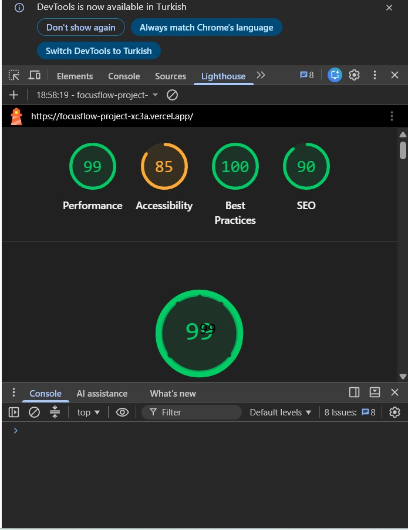

# ⚡ FocusFlow AI - Yapay Zeka Destekli Zaman Yönetimi platformu

🌍 **Canlı Demo (Live Preview):** [Projeyi İncelemek İçin Tıklayın](https://focusflow-project-xc3a.vercel.app/)

FocusFlow AI; kullanıcıların çalışma alışkanlıklarını analiz eden, görevlerin bilişsel yüküne göre ideal Pomodoro seanslarını tahmin eden ve işleri öncelik sırasına koyarak derin odaklanma (Deep Work) sağlayan kurumsal seviyede bir **Zaman Yönetimi ve Landing Page (Ürün Tanıtım) platformudur**. 

Bu proje, esnek bileşen mimarisi (UI Library), gelişmiş state yönetimi ve kullanıcı deneyimi (UX) standartları göz önünde bulundurularak hibrit bir yapıda geliştirilmiştir.

---

## 🚀 Çekirdek Özellikler

- **🧠 Öngörülü Yapay Zeka Analitiği:** Girilen görevin karmaşıklığını ve kategorisini inceleyerek tamamlanması gereken ideal Pomodoro seans sayısını otomatik hesaplar.
- **📊 Öncelik Tabanlı Akıllı Sıralama:** Görevler "Yüksek, Orta, Düşük" öncelik seviyelerine göre gerçek zamanlı olarak akıllı bir sıralama algoritmasıyla dizilir. Acil işler her zaman en üstte yer alır.
- **⏱️ Çift Modlu Entegre Sayaç:** Çalışma seansı (25 dk) ve Mola seansı (5 dk) geçişlerini otomatik yönetir. Sayaç, aktif olarak odaklanılan göreve bağlanır.
- **🔄 Görev Odaklı Dinamik Güncelleme:** Bir Pomodoro seansı başarıyla tamamlandığında, odaklanılan görevin kalan seans sayısı otomatik olarak düşürülür. Görevler tek tıkla "Tamamlandı" olarak işaretlenebilir.
- **💼 Esnek Onboarding & Dönüşüm Hunisi:** Bireysel kullanıcılar için düşük sürtünmeli kayıt alanı sunarken, "Enterprise (Takım)" planı için şirkete özel kişi sayısı ve departman bilgisi alan dinamik bir kurumsal veri toplama modalı barındırır.
- **🌙 Akıllı Tema Motoru:** Gece ve gündüz çalışma dinamiklerine tam uyumlu, göz yorgunluğunu sıfırlayan Işık/Karanlık mod desteği.

---

## 🛠️ Teknoloji Yığını (Tech Stack)

- **Framework / Runtime:** React v18, Vite
- **Dil:** TypeScript (Sıkı Tip Güvenliği)
- **Stil Yönetimi:** Sass / SCSS (Modüler ve Responsive Mimari)
- **Paket Yönetimi:** NPM

---
## 🚀 Performans ve Lighthouse Skoru
Proje, gereksinimlerde belirtilen minimum 90/100 performans hedefini başarıyla aşmıştır.


## 🏗️ Mimari Notlar ve Karar Kayıtları (ADR)
- **Erişilebilirlik (a11y) Tercihi:** SSS (Accordion) bölümünde harici bir React state yönetimi kullanmak yerine, native HTML5 `<details>` ve `<summary>` etiketleri kullanılarak klavye gezintisi ve ekran okuyucu uyumluluğu maksimize edilmiştir.
- **State Yönetimi:** Proje küçük ölçekli olduğu için Redux veya Context API yerine React'in yerleşik `useState` kancası ile component prop-drilling yapısı kullanılmıştır.
- **Stil Mimarisi:** Modüler SCSS tercih edilmiş olup, tüm renk paletleri `:root` altında CSS değişkenleri olarak tanımlanmış, bu sayede karanlık mod entegrasyonu O(1) karmaşıklığında çözülmüştür.

## 📅 Gün Gün Geliştirme Süreci (Sprint Log)

### 🔹 1. Gün: Altyapı ve Atomik UI Bileşenlerinin Kurulması
- Vite mimarisi üzerinde TypeScript ve React projesi ayağa kaldırıldı.
- Sıkı tip güvenliğine sahip atomik bileşenler (`Button`, `Input`, `Select`) geliştirildi.
- Projenin renk paleti, Işık/Karanlık mod değişkenleri (`CSS Variables`) `index.css` üzerinde tanımlanarak tema altyapısı hazırlandı.

### 🔹 2. Gün: Kurumsal Landing Page Tasarımı ve Metrik Entegrasyonu
- Şık ve modern bir Hero alanı, düşük sürtünmeli kullanıcı kayıt formu tasarlandı.
- Ürünün sosyal kanıtını güçlendirmek amacıyla performans ve kullanıcı istatistiklerini içeren **Metrics Bar** arayüze eklendi.
- 3 farklı iş modeline uygun fiyatlandırma kartları (`Starter`, `FocusPro`, `Enterprise`) kurumsal SaaS standartlarında geliştirildi.

### 🔹 3. Gün: Çekirdek Görev ve Zaman Yönetimi Altyapısı
- Görev ekleme, silme ve durum güncelleme dinamikleri için gerekli React state yapıları kuruldu.
- Görevlerin durumuna göre (`isCompleted`) arayüzde görsel olarak biçimlendirilmesini (üstünün çizilmesi, opaklık ayarı) sağlayan mantıksal süreçler tamamlandı.
- İş dünyasından popüler 6 gelişmiş kategori (Yazılım, Akademi, Finans, Pazarlama, Strateji, Kişisel Gelişim) sisteme entegre edildi.
- Görevlerin önem derecesine göre otomatik olarak yukarıda listelenmesini sağlayan **Öncelik Tabanlı Sıralama Algoritması** kodlandı.

### 🔹 4. Gün: 6 Kategorili AI Motoru ve Akıllı Sıralama Algoritması
- `Timer` bileşeni, aktif görevi tanıyacak ve çalışma bittiğinde o görevden otomatik seans düşecek şekilde optimize edildi. 5 dakikalık mola fonksiyonu entegre edildi.
- Enterprise (Takım) planı için kişi sayısı ve departman alan kurumsal lead toplama modalı ile bireysel planlar için model hassasiyet kalibrasyonu modalları optimize edildi.
- Sass derleme pürüzleri giderildi ve proje sıfır hata ile üretime hazır hale getirildi.
- Geliştirme (`dev`) ortamında tamamlanan kodlar, üretim (`main`) ortamına güvenli bir şekilde aktarıldı (Git Merge işlemi).
- Vercel üzerindeki katı TypeScript derleme (build) süreçlerinden geçebilmek adına; kullanılmayan eski bileşenler (örn: eski Taskform) ve "Ghost Process" yaratan dosyalar tespit edilerek projeden temizlendi (Code Refactoring).
- Proje, Vite altyapısı kullanılarak **Vercel** platformuna entegre edildi. Başarılı bir şekilde canlı (Live) yayına alınarak son kullanıcı ve jüri testine hazır hale getirildi.
---

## 📦 Kurulum ve Çalıştırma

1. Proje bağımlılıklarını yükleyin:
```bash
npm install 
```

2. Projeyi lokal sunucuda başlatın:
```bash
npm run dev
```

